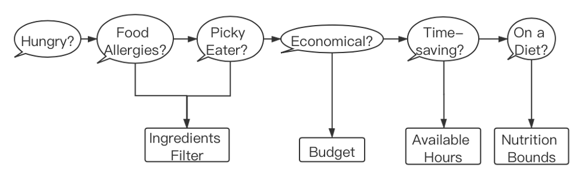

# Personalized Meal Recommender

This project generates an optimum 5-day meal plan for two people in the same household through Survey, Web Scrapping, Data Processing, Collaborative Filtering, and Mixed Integer Programming. Feel free following the [Usage](##Usage) to make it personalized.

## Background

A forethought of meal plan is very efficient and popular nowadays. To help with this problem, we aim to maximize the sum of potential ratings from two users for all recipes being selected. Also, keeping similar cooking time for each person can avoid quarrels. Then, the 5 recipes must meet some conditions, such as healthy weekly nutrition, the schedule of cooking time and the total expenses. 

Below the model is formulated in mathematical language.

subject to

Our project works well on three different scenarios, and details can be found [here](report.pdf). 

## Usage
### Step1: Survey
Determine values of parameters in the model
- Input: Survey
- Output: RHS parameters
- Procedure

### Step2: Web Scraping
Collect related recipes data 
- Input: [Yummly.com](https://www.yummly.com/guided-video-recipes)
- Output: [recipes_data.json](./data/recipes_data.json)
- Tool: Python, [chromedriver](chromedriver)
- Procedure: [Get_Recipe_Data.ipynb](./src/Get_Recipe_Data.ipynb)

### Step3: Data Processing
Store recipes data and construct recipes-user-rating matrix 
- Input: [recipes_data.json](./data/recipes_data.json)
- Output: [recipe_info.csv](./data/recipe_info.csv), [final_rating_data.csv](./data/final_rating_data.csv)
- Tool: Python
- Procedure: [Get_Recipe_Data.ipynb](./src/Get_Recipe_Data.ipynb)

### Step4: Collaborative Filtering
Fill recipes-user-rating matrix 
- Input: [final_rating_data.csv](./data/final_rating_data.csv)
- Output: [recipe-user-rating-after-matrix-completion.csv](./data/recipe-user-rating-after-matrix-completion.csv)
- Tool: R
- Procedure: [MnM_SL.ipynb](./src/MnM_SL.ipynb)

### Step5: Mixed Integer Programming
Model the program and solve to get the recommendation result
- Input: [recipe-user-rating-after-matrix-completion.csv](./data/recipe-user-rating-after-matrix-completion.csv), [recipe_info.csv](./data/recipe_info.csv), RHS parameters
- Output: Meal recommendation
- Tool: Python, [IBM Decision Optimization on Cloud Service](https://www.ibm.com/support/producthub/iias/docs/content/SSHRBY/com.ibm.swg.im.iias.getstart.doc/doc/app_tut_dsx3.html)
- Procedure: [MnM_MIP.ipynb](./src/MnM_MIP.ipynb)

## Maintainers

[@xiongjia000777](https://github.com/xiongjia000777)

[@lionemilio95](https://github.com/lionemilio95)

[@zhp006](https://github.com/zhp006)

[@wh0404](https://github.com/wh0404)

